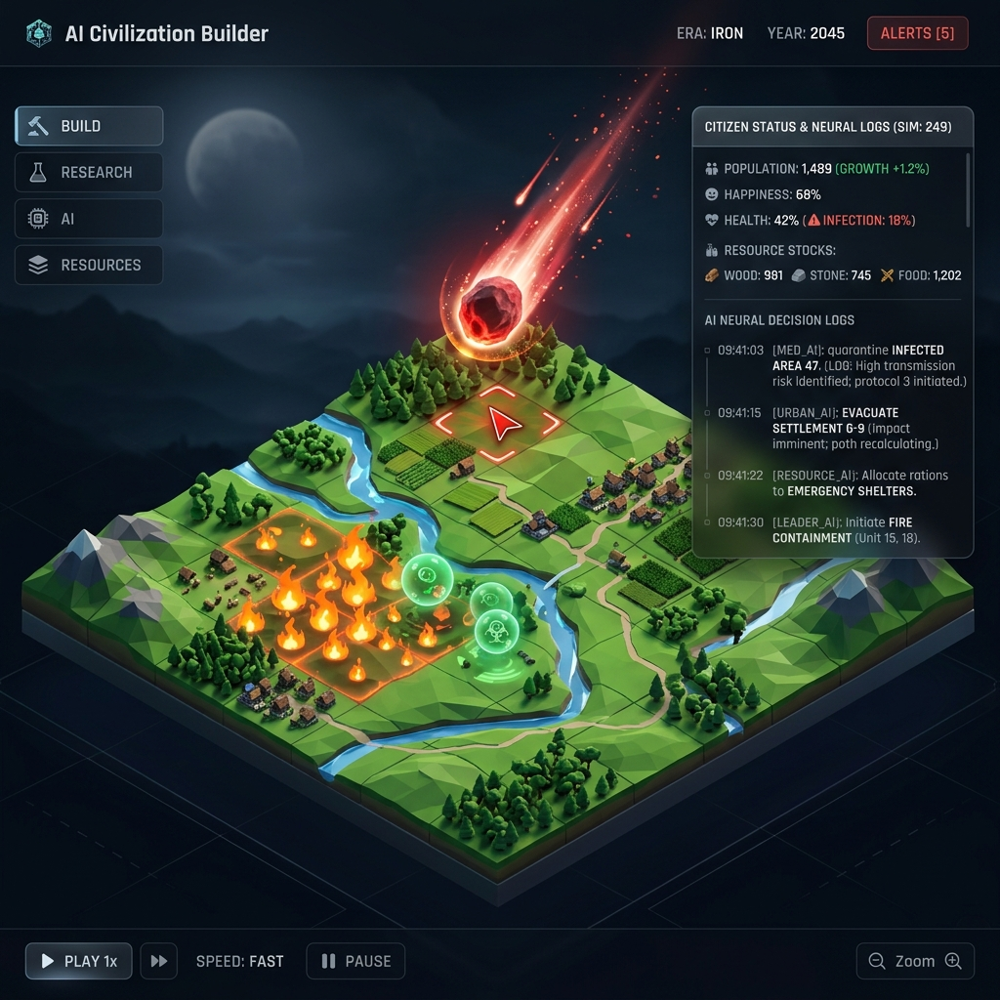
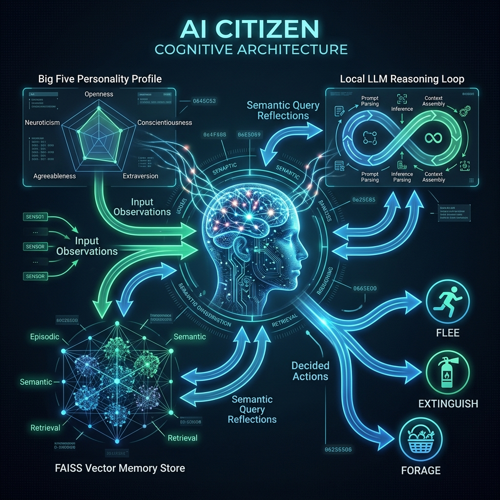

# AI Civilization Builder 🌍🤖

<p align="center">
  
</p>

AI Civilization Builder is an open-source, local-first simulation platform for creating, observing, and modifying living, programmable civilizations. Instead of static NPCs or simple state-machine agents, this platform combines spatial agent-based models (using the Mesa framework) with cognitive reasoning pipelines powered by local LLMs (via Ollama). 

With a FastAPI backend, a vector-based memory system, and an interactive 3D web interface built with Next.js and React Three Fiber, you can run detailed sociological, economic, and political simulations completely offline.

---

## 🌟 Key Features

- **Brain-in-a-Grid Citizens**: Each agent is an autonomous citizen with a Big Five personality profile, a dynamic DNA sequence, evolving needs (hunger, health, energy), and a cognitive reasoning pipeline.
- **Cognitive Reasoner & Local AI**: Agents make choices by reflecting on recent vector memories and querying local models (e.g., Llama 3 or Qwen2.5-Coder via Ollama) with seamless fallback to rule-based behavioral heuristics if the LLM is offline or times out.
- **Wrath of God Disaster Simulator**: Trigger environmental crises including imminent meteor strikes, viral epidemic outbreaks, and corrosive acid rain storms on selected coordinates directly from the interactive 3D viewport.
- **Active Emergency Adaptive Heuristics**: Citizens adapt dynamically to threats (fleeing fire tiles, quarantine/medication for virus outbreaks, and searching plains/forests for healing herbs).
- **Vector Memory (FAISS)**: Persistent, semantic memory storage using `sentence-transformers` and `FAISS` to store and retrieve agent observations, decisions, and outcomes.
- **Hybrid Data Architecture**:
  - **SQLite**: Stores active relational states (worlds, alive/dead citizens).
  - **DuckDB**: Fast, column-store timeseries database for live simulation event history and analytical queries.
  - **FAISS**: Local vector files storing citizen memories.
- **Interactive 3D Viewport**: Built on React Three Fiber and OrbitControls. Pan, zoom, orbit, and click individual citizens to inspect their profiles, inventories, and decision explanations.
- **Real-time Synchronization**: WebSockets-based synchronization between the Python simulation loop and the Zustand frontend store.
- **Moddable Plugin SDK**: Define new economic agents, change market/trade rules, and inject custom heuristics using python classes.

---

## 🏗️ Repository Architecture

The project is structured into modular components:

```
├── backend/                  # FastAPI & Simulation Engine
│   ├── app/
│   │   ├── agents/           # Cognitive brain, FAISS memory, needs & values
│   │   ├── api/              # WebSocket router & endpoints
│   │   ├── core/             # Simulation engine (Mesa), scheduler, spatial map
│   │   ├── models/           # SQLAlchemy schemas (Citizen, World, etc.)
│   │   ├── simulation/       # Simulation logic (Economy, Laws, Diplomacy, Science)
│   │   ├── utils/            # Helper scripts and general utilities
│   │   ├── config.py         # App configurations (settings & env vars)
│   │   ├── database.py       # DB initialization & connections
│   │   └── main.py           # FastAPI entrypoint
│   └── requirements.txt      # Python dependencies
│
├── frontend/                 # React/Next.js Web Interface
│   ├── app/                  # Pages, global CSS, layout configuration
│   ├── components/
│   │   ├── Charts/           # D3/Recharts economic dashboard charts
│   │   └── Map3D/            # React Three Fiber World Viewport
│   ├── store/                # Zustand simulation state store
│   └── tailwind.config.js    # TailwindCSS styling setup
│
├── sdk/                      # Modding & Extensions SDK
│   └── civ_sdk/
│       └── plugin.py         # SDK plugin templates for economy and behavior
│
├── notebooks/                # Analytics & Prototyping
│   └── 01_economic_shock_test.ipynb
│
├── install.ps1               # Automated local installer script
└── README.md                 # Project Documentation (This File)
```

---

## ⚙️ Prerequisites & Setup

Ensure you have the following installed on your machine:
1. **Python 3.10+**
2. **Node.js 18+ (and npm)**
3. **Ollama** (Recommended, for cognitive agent reasoning)

### 1. Automatic Quickstart (Windows PowerShell)

Run the automated installer script to create the Python virtual environment, install backend and frontend packages, and verify your local Ollama tags.

```powershell
Set-ExecutionPolicy -ExecutionPolicy RemoteSigned -Scope Process
.\install.ps1
```

### 2. Manual Installation

If you prefer to set up the workspace step-by-step:

#### Backend Setup
```bash
# Navigate to the backend
cd backend

# Create virtual environment
python -m venv .venv
source .venv/bin/activate  # On Windows: .venv\Scripts\activate

# Install dependencies
pip install --upgrade pip
pip install -r requirements.txt
```

#### Frontend Setup
```bash
# Navigate to the frontend
cd frontend

# Install Node modules
npm install
```

#### Ollama Cognitive Model Setup
To use cognitive reasoning, install and run [Ollama](https://ollama.com/), then pull the default reasoning model:
```bash
ollama pull llama3
```

---

## 🚀 Running the Simulation

Follow these steps to launch the backend, frontend, and connect them.

### Step 1: Start the Backend WebServer
Activate your virtual environment and run the Uvicorn FastAPI server:
```bash
cd backend
.venv\Scripts\python -m uvicorn app.main:app --reload --port 8000
```
The REST API will be available at `http://127.0.0.1:8000`. You can inspect the interactive OpenAPI documentation at `http://127.0.0.1:8000/docs`.

### Step 2: Start the Frontend Dashboard
Open a new terminal window, navigate to the frontend directory, and spin up the development server:
```bash
cd frontend
npm run dev
```
Open `http://localhost:3000` in your browser. The web client will automatically attempt to connect to the backend websocket route: `ws://localhost:8000/ws/simulation/demo-civilization-uuid`.

---

## ⛈️ The Wrath of God: Crisis Summoner

<p align="center">
  
</p>

The platform features an active simulation of environmental disasters and dynamic climate impacts:
1. **☄️ Imminent Meteor**: Strike coordinates to spawn immediate fire zones that expand to neighboring tiles, burning resources and agents.
2. **🦠 Viral Epidemic**: Release infections starting from patient zero. Sick agents lose health over time and transmit the virus to adjacent citizens once they reach critical sickness level (>30).
3. **🌧️ Corrosive Acid Rain**: Summons a toxic cloud eroding crop/resource nodes and slowly decaying citizen health.

Citizens adapt to crises in real-time. If an active disaster or fire is detected nearby, citizens trigger emergency actions:
- `FLEE`: Run away from fire paths and threat coordinates.
- `EXTINGUISH`: Attempt to fight fires on adjacent tiles.
- `QUARANTINE`: Isolate physically from neighbors to prevent viral transmission.
- `MEDICATE`: Use herbs or forage plains to seek healing resources and recover health.

---


## 🔬 SDK Modding & Custom Plugins

You can extend and modify the behavior of the simulation or customize rules (like prices or behavior routes) using the SDK in `sdk/civ_sdk/plugin.py`.

Example plugin configuration:
```python
from civ_sdk.plugin import BasePlugin, EconomyModifierPlugin

# Create a modifier to alter iron commodity base prices
class CustomIronInflationPlugin(EconomyModifierPlugin):
    def modify_clearing_price(self, resource: str, current_price: float) -> float:
        if resource == "iron":
            return current_price * 1.55  # inflate iron price by 55%
        return current_price
```

You can hook these plugins directly into the simulation start or tick update events to observe how changes flow through the economy in real-time.

---

## 📊 Notebooks & Scientific Analysis

Use Jupyter notebooks inside the `notebooks/` directory to run isolated tests. For example, `01_economic_shock_test.ipynb` triggers economic anomalies (e.g., resources scarcity) and records agent adaptation rates.

To run notebooks:
```bash
# Install notebook runner inside backend venv
pip install jupyterlab
jupyter lab
```

---

## 📜 Key Configuration Settings

Environment variables can be customized with the prefix `CIV_`. The core options are defined in [config.py](file:///d:/open%20source%20projects/AI%20Civilization%20Builder/backend/app/config.py):

| Variable | Default Value | Description |
|---|---|---|
| `CIV_OLLAMA_URL` | `http://localhost:11434` | Endpoint of the Ollama server |
| `CIV_OLLAMA_MODEL` | `llama3` | Main AI Citizen cognitive model |
| `CIV_WORLD_WIDTH` | `50` | Width of the simulation grid |
| `CIV_WORLD_HEIGHT` | `50` | Height of the simulation grid |
| `CIV_INITIAL_CITIZENS`| `20` | Count of citizens spawned at start |
| `CIV_DEFAULT_TICK_RATE_MS`| `1000` | Minimum delay per simulation step |
| `CIV_REDIS_URL` | `""` | Optional external pubsub event bus URL |

---

## 🤝 Contributing

Contributions to the AI Civilization Builder are welcome! Check out open issues or submit pulls to add simulation systems, backend heuristics, memory pruning policies, or new frontend charts.
